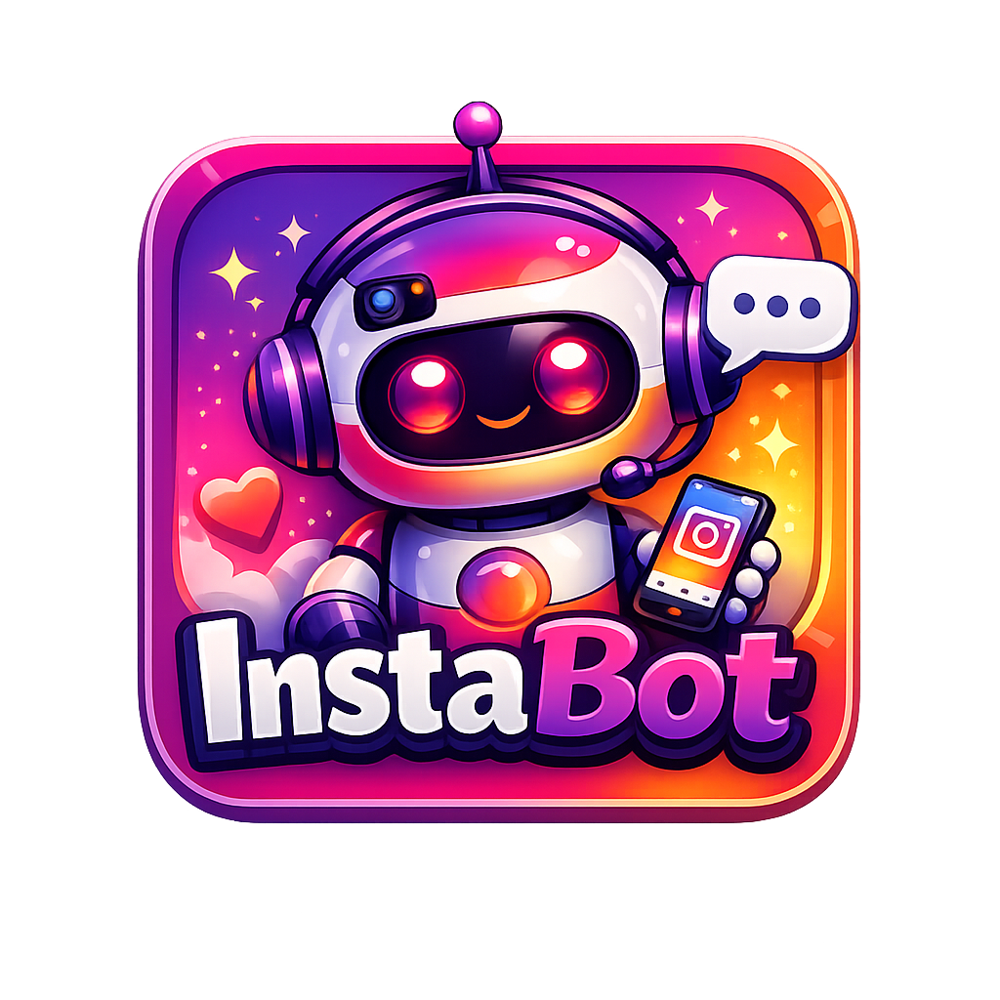

<div align="center">



# Insta Bot

### Instagram DM Automation Tool

**Send personalized DMs to hundreds of Instagram profiles — automatically.**

[](https://instabot-saif.vercel.app)
[](https://wa.me/923097171127?text=Hi%20I%20want%20to%20buy%20Insta%20Bot%20license)
[](https://github.com/Saifullah10141/Insta-Bot/releases/download/v1.4.2.0/Insta.Bot.exe)
[](https://github.com/Saifullah10141/Insta-Bot/releases/download/v1.4.2.0/Insta.Bot.exe)

<br/>

[⬇️ Download Now](https://github.com/Saifullah10141/Insta-Bot/releases/download/v1.4.2.0/Insta.Bot.exe) &nbsp;&nbsp;·&nbsp;&nbsp;
[🌐 Visit Website](https://instabot-saif.vercel.app) &nbsp;&nbsp;·&nbsp;&nbsp;
[💬 Get License](https://wa.me/923097171127?text=Hi%20I%20want%20to%20buy%20Insta%20Bot%20license) &nbsp;&nbsp;·&nbsp;&nbsp;
[📧 Email Us](mailto:saifullahanwar00040@gmail.com)

</div>

---

## ✨ What is Insta Bot?

**Insta Bot** is a professional Windows desktop application built by **Saif Developers** that automates Instagram DM outreach. Add your target profiles, write your messages, set your delays — and let the bot handle the rest while you focus on closing deals.

> ⚡ Protected with cloud license system · Compiled to native C++

---

## 🚀 Features

| Feature | Description |
|---|---|
| 📨 **Bulk DM Sending** | Automatically send DMs to hundreds of Instagram profiles |
| 🔀 **Message Rotation** | Add multiple messages — bot picks one randomly per profile |
| ⏱ **Smart Delays** | Custom min/max delay control to mimic human behavior |
| 📊 **Live Output Log** | Color-coded real-time log — see every success and failure |
| 💾 **Auto-Save** | All settings saved automatically between sessions |
| 🔐 **License Protection** | Hardware-bound cloud license — one key per machine |
| 🛑 **Stop Anytime** | Graceful stop button — finishes current DM then halts |
| 🌐 **Cloud Verification** | License verified on every startup — remotely revokable |

## 📥 Download & Setup

### Requirements
- Windows 8 / 10 / 11
- Google Chrome installed
- Active internet connection (for license verification)

### Installation

**1.** Download the latest installer:

```
👉 https://github.com/Saifullah10141/Insta-Bot/releases/download/v1.4.2.0/Insta.Bot.exe
```

**2.** Run `Insta Bot.exe` — the installer will guide you through setup.

> The installer will:
> - Create a Start Menu shortcut
> - Add a Desktop shortcut
> - Register the app for clean uninstallation via Windows Settings

**3.** Launch **Insta Bot** from the Desktop or Start Menu.

**4.** Enter your license key on the activation screen.

**5.** On first run — log into Instagram in the Chrome window that opens. Session is saved automatically.

### Uninstall

Go to **Windows Settings → Apps → Insta Bot → Uninstall** — clean removal, no leftover files.

---

## 🔑 License System

Insta Bot uses a **proprietary cloud-based licensing system** with multi-layer protection:

- ✅ Each key is permanently bound to a single machine
- ✅ License verified on every launch against our servers
- ✅ Keys cannot be shared, copied, or transferred
- ✅ Remote revocation — any license can be disabled instantly
- ✅ No offline bypass possible

---

## 📖 How to Use

```
Step 1 ──▶ Open Insta Bot.exe
Step 2 ──▶ Enter license key → Activate
Step 3 ──▶ Profiles tab: add Instagram usernames
Step 4 ──▶ Messages tab: write your DM messages
Step 5 ──▶ Delays tab: set timing (seconds) between actions
Step 6 ──▶ Settings tab: verify Chrome path
Step 7 ──▶ Click ▶ Run Bot
Step 8 ──▶ Monitor live results in Output tab
```

---

## ⚙️ Delay Settings

| Setting | Default | Description |
|---|---|---|
| Startup delay | 6 – 10s | Wait after Instagram opens |
| Page load wait | 3 – 5s | After opening each profile |
| After Message click | 2 – 3s | Before typing begins |
| Between DMs | 8 – 15s | Gap between each DM |
| After sending | 4 – 6s | Wait before moving on |

> 💡 **Tip:** Keep "Between DMs" at 10–20s minimum. At default settings, expect **80–100 DMs per day** comfortably.

---

## 🛡️ Safety Tips

- Keep daily DMs between **80–100 per day** for safest operation
- Use **realistic delays** — larger values look more human-like
- **Rotate messages** — add 3–5 variants to avoid spam detection
- Log in to Instagram **manually on first run** for a clean session
- Avoid sending DMs to the **same account twice**
- Keep Chrome and the bot **updated**

---

---

## 📁 Data Storage

All data is stored in:
```
C:\Users\<YourName>\AppData\Local\InstaBot\src\
│
├── data.json          ← profiles, messages, delays, chrome path
├── license.key        ← your activation key
└── chrome_profile\    ← Instagram login session
```

---

## ❓ FAQ

<details>
<summary><b>How do I get a license key?</b></summary>
<br>
Click the "Get License Key" button in the app or message us on WhatsApp at <b>+92 309 717 1127</b>. We respond quickly.
</details>

<details>
<summary><b>Can I use one key on multiple computers?</b></summary>
<br>
No. Each license is bound to a single machine via hardware fingerprinting. Contact us to transfer your license to a new machine.
</details>

<details>
<summary><b>What happens if I have no internet?</b></summary>
<br>
Insta Bot requires an active internet connection to verify your license on every startup. Without internet, the app will not open.
</details>

<details>
<summary><b>Will my Instagram account get banned?</b></summary>
<br>
Insta Bot mimics human behavior with randomized delays and message rotation. However, sending DMs at scale always carries some risk. We recommend staying within <b>80–100 DMs per day</b> at default delay settings for the safest experience.
</details>

<details>
<summary><b>Does it work on Mac or Linux?</b></summary>
<br>
Currently Windows only (8, 10, 11). Mac/Linux support is not planned at this time.
</details>

<details>
<summary><b>How do I uninstall Insta Bot?</b></summary>
<br>
Go to <b>Windows Settings → Apps → Insta Bot → Uninstall</b>. The uninstaller removes all app files cleanly. Your data in AppData will be removed too.
</details>

<details>
<summary><b>My antivirus flagged the EXE — is it safe?</b></summary>
<br>
Yes, this is a known false positive with Nuitka-compiled executables. Add an exception in your antivirus for SaifInstaBot.exe.
</details>

---

## 📞 Contact & Support

<div align="center">

| | | |
|:---:|:---:|:---:|
| 💬 **WhatsApp** | 📧 **Email** | 🌐 **Website** |
| [+92 309 717 1127](https://wa.me/923097171127) | [saifullahanwar00040@gmail.com](mailto:saifullahanwar00040@gmail.com) | [instabot-saif.vercel.app](https://instabot-saif.vercel.app) |

</div>

---

<div align="center">

Made with ❤️ by **[Saif Developers](https://instabot-saif.vercel.app)**

© 2026 Saif Developers · All Rights Reserved

</div>
